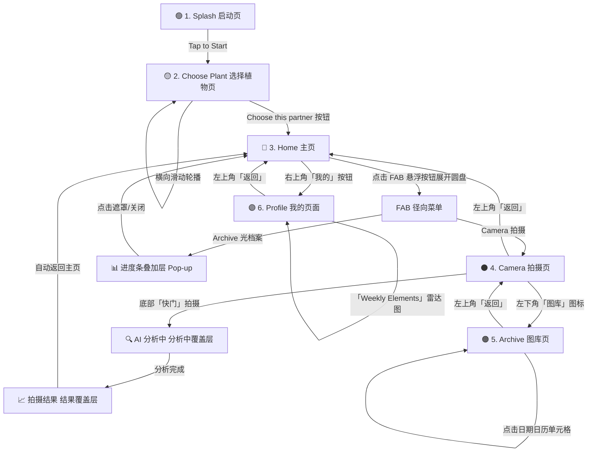

```mermaid
graph TD
    A["🟢 1. Splash 启动页"] -->|Tap to Start| B["🟡 2. Choose Plant 选择植物页"]
    B -->|横向滑动轮播| B
    B -->|"Choose this partner" 按钮| C["🔵 3. Home 主页"]

    C -->|右上角「我的」按钮| F["🟣 6. Profile 我的页面"]
    C -->|点击 FAB 悬浮按钮展开圆盘| C1["FAB 径向菜单"]
    C1 -->|Camera 拍摄| D["⚫ 4. Camera 拍摄页"]
    C1 -->|Archive 光档案| C2["📊 进度条叠加层 Pop-up"]

    D -->|底部「快门」拍摄| D1["🔍 AI 分析中 分析中覆盖层"]
    D1 -->|分析完成| D2["📈 拍摄结果 结果覆盖层"]
    D -->|左下角「图库」图标| E["🟠 5. Archive 图库页"]
    D -->|左上角「返回」| C

    E -->|点击日期日历单元格| E
    E -->|左上角「返回」| D

    F -->|「我的植物」卡片| F
    F -->|「Light Archive」日历| F
    F -->|「Weekly Elements」雷达图| F
    F -->|左上角「返回」| C

    C2 -->|点击遮罩/关闭| C
    D2 -->|自动返回主页| C
```